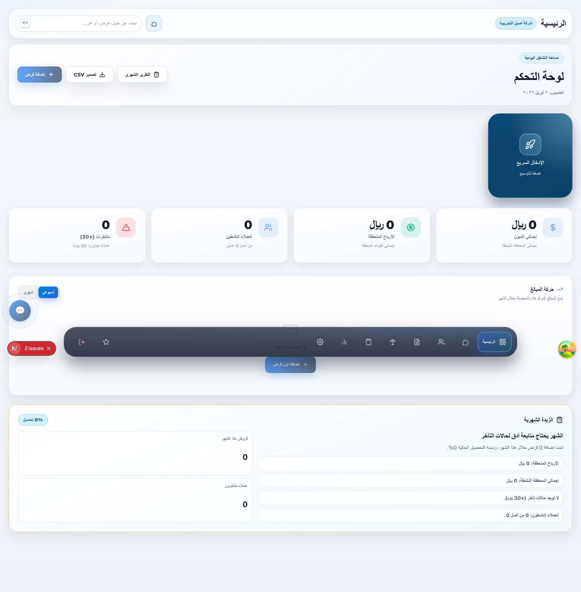
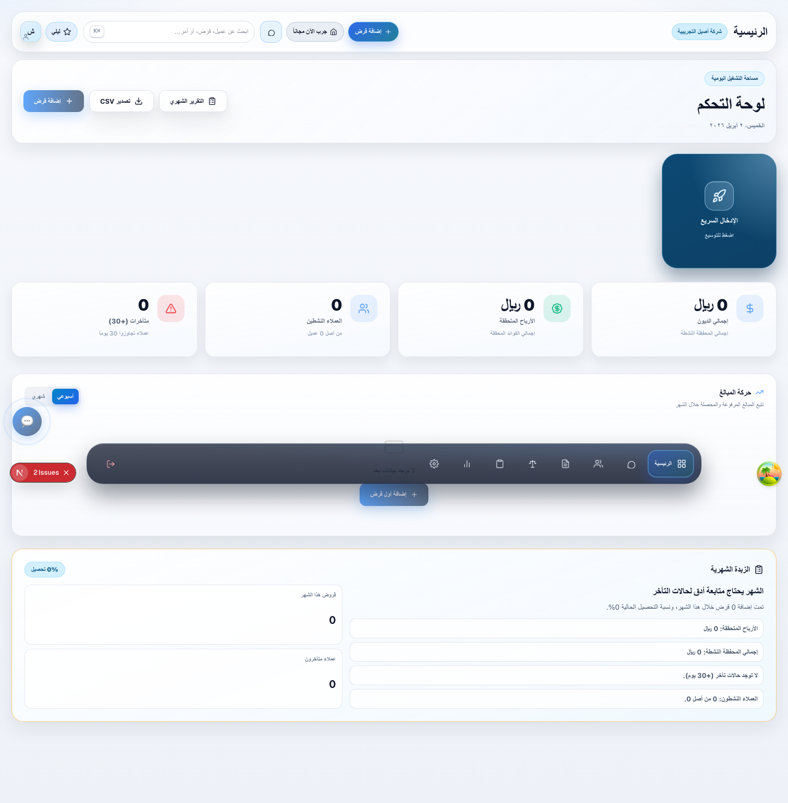

# PR4 Before/After Screenshots

Context:
- Page: `GET /dashboard`
- Viewport: `1512x945`
- Capture method: Playwright (headless)
- Local storage seeded with demo merchant/token to render the dashboard shell consistently
- Backend APIs were unavailable during capture, so comparison focuses on shell UX changes (topbar controls, CTA hierarchy, theme toggle placement)

## Before (Base: `851d69d`)

## After (PR4: `bf9ab1a`)

## What changed visually

- Theme toggle moved into topbar user tools next to avatar
- Primary/secondary CTA buttons added to topbar (`إضافة قرض`, `جرب الآن مجاناً`)
- Quick entry CTA remains available while preserving compact interaction
- Header control grouping is clearer for decision-heavy financial workflows
